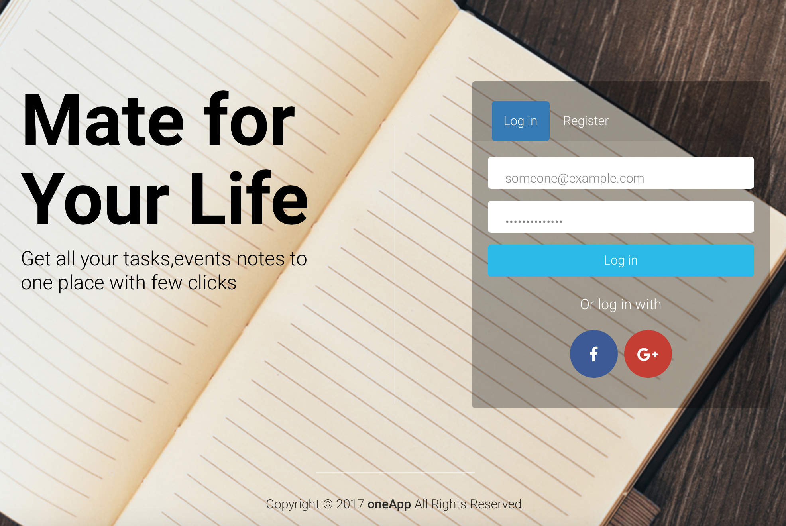

# oneApp
### Mission 
- To centralize personal **Todo's, Events, Notes (scattered data)** across many platforms.

#### Problem we are addressing 
- People tend to have a couple of email addresses on various cloud providers
- modern cloud providers extract important data from emails,
- **(example: they prompts the user to create an event if the email contains data about a particular event**
- So we assign those events to our Cloud Provider's Calendar

⚠️️ **Calendar app depends on the phone/platform you're Using**
**Because of the above reason based on the Device (out of many we have) there are many calendars availble**

### Example of the platforms

### Ballerina Helps Achieve this (backend)?
#### Plus Points 👍
- We didn't need other third party apps for extracting data from Gmail, and Google Calendar 
- 

#### Negative Points 👎 (what we think)
- Rather than throwing an error about unused imports, what we think is ballerina should effciently give a warning to the user, and shouldn't load that specific unused library to the RAM

